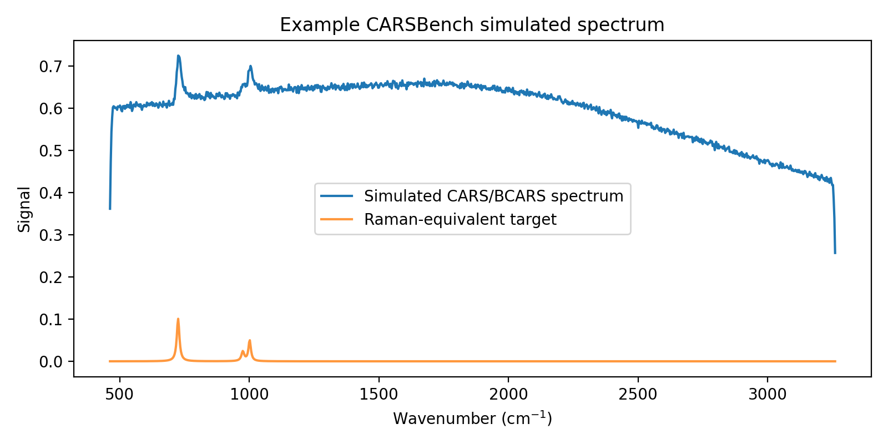

# CARSBench


**CARSBench** is a simulation and benchmarking framework for broadband Coherent Anti-Stokes Raman Scattering (BCARS/CARS) spectroscopy.

It generates synthetic CARS/BCARS spectra with controlled domain shifts, so that Raman-retrieval and machine-learning models can be tested for robustness across different acquisition, background, calibration, and biochemical conditions.

---

## Why this project matters

Machine-learning models for Raman retrieval from CARS/BCARS spectra often perform well on the setting they were trained on and degrade when acquisition conditions change. Because the ground-truth Raman signal is rarely available experimentally, this failure mode is difficult to measure on real data.

CARSBench addresses both problems at once: it simulates spectra *together with* their Raman-equivalent targets, and it varies the acquisition conditions in controlled, labelled ways:

- spectral resolution
- detector noise
- baseline drift
- spectral calibration
- spectral window
- non-resonant background shape
- biochemical composition

Each factor becomes a benchmark domain, so a model can be trained on one and tested on another. The goal is to make domain-generalization experiments in spectroscopy-aware machine learning systematic rather than anecdotal.

---

## Example output



---

## Quickstart

Generate a small dataset from the reference domain:

```python
import CARSBench as cb

batch = cb.generate_dataset(
    num_samples=100,
    domain_name="A_typical",
    seed=42,
)

print(len(batch.samples))
print(cb.list_domains())
```

Access one simulated sample:

```python
sample = batch.samples[0]

axis = sample.axis
spectrum = sample.spectrum
target = sample.raman_target
```

Plot it:

```python
import matplotlib.pyplot as plt

plt.plot(axis, spectrum)
plt.xlabel("Wavenumber (cm$^{-1}$)")
plt.ylabel("Intensity")
plt.title("Simulated CARS/BCARS spectrum")
plt.show()
```

---

## Key features

- Frequency-domain BCARS/CARS forward simulation
- Complex resonant and non-resonant susceptibility modeling
- Biochemical prototype-based Raman-like signal generation
- Eight benchmark domain presets
- Per-sample parameter variability
- Reproducible generation with fixed random seeds
- Chunked dataset writing for large synthetic datasets
- Metadata export for simulation parameters
- Quality-control and visualization scripts
- Benchmark metrics for Raman-retrieval evaluation
- Lightweight baseline benchmark script
- Unit tests and GitHub Actions CI

---

## Project status

CARSBench is **alpha-stage research software**.

| Component | Status |
|---|---|
| Frequency-domain BCARS/CARS simulation | Implemented |
| Eight domain presets | Implemented |
| Raman-equivalent target generation | Implemented |
| Chunked dataset writing | Implemented |
| Multi-seed generation workflow | Implemented |
| QC and validation scripts | Implemented |
| Visualization scripts | Implemented |
| Baseline benchmark utilities | Implemented |
| Basic API tests | Implemented |
| Domain generation tests | Implemented |
| Reproducibility tests | Implemented |
| Dataset I/O tests | Implemented |
| Benchmark metric tests | Implemented |
| GitHub Actions CI | Implemented |
| Citation metadata | Implemented |
| Changelog | Implemented |
| Full ML training benchmark | Planned |
| Real experimental validation | Planned |

---

## Simulation pipeline

CARSBench separates simulation into four stages.

**1. Biochemical prototype library.** Raman-like resonant peaks are generated from
biochemical prototype components such as lipid, protein, nucleic-acid, and aromatic
spectral patterns.

**2. Clean Raman-like mixture generation.** Random mixtures of prototype components
create sample-to-sample biochemical variability.

**3. CARS/BCARS forward model.** The resonant susceptibility is combined with a
non-resonant background to generate a CARS-like intensity signal.

**4. Measurement and domain effects.** Domain-specific acquisition effects are applied:
spectral resolution, noise, baseline drift, calibration shift, spectral-window shift,
and NRB variation.

---

## Benchmark domains

| Domain | Description | Main shift type |
|---|---|---|
| `A_typical` | Typical BCARS acquisition | Reference domain |
| `B_high_res` | Higher spectral resolution | Measurement shift |
| `C_low_res_noisy` | Lower resolution with stronger noise | Measurement shift |
| `D_calibration_shift` | Spectral calibration shift and warp | Calibration shift |
| `E_window_shift` | Different spectral window | Window shift |
| `F_nrb_family_shift` | Different NRB shape family | NRB shift |
| `G_biochemical_source` | Lipid/protein-dominant chemistry | Biochemical shift |
| `H_biochemical_target` | Nucleic/aromatic-dominant chemistry | Biochemical shift |

See [`docs/domains.md`](docs/domains.md) for detailed descriptions and suggested setups.

These domains support cross-domain generalization experiments, for example:

- train on typical acquisition conditions, test on noisy spectra
- train on one biochemical composition, test on another
- evaluate whether retrieval methods are robust to NRB-family changes
- evaluate whether calibration shifts degrade Raman-retrieval quality

---

## Installation

```bash
git clone https://github.com/rhouhou/CARSBench.git
cd CARSBench
```

Create and activate a virtual environment:

```bash
python -m venv .venv

# macOS / Linux
source .venv/bin/activate

# Windows
.venv\Scripts\activate
```

Install the package in editable mode:

```bash
python -m pip install --upgrade pip setuptools wheel
python -m pip install -e .
```

Optional extras:

```bash
python -m pip install -e ".[dev]"             # development tools
python -m pip install -e ".[dev,analysis]"    # plus analysis and plotting
python -m pip install -r requirements.txt     # local analysis requirements
```

On systems where the interpreter is `python3`, substitute `python3` throughout.

### Installation check

```bash
python -c "import CARSBench as cb; print(cb.list_domains())"
```

Expected output:

```text
['A_typical', 'B_high_res', 'C_low_res_noisy', 'D_calibration_shift', 'E_window_shift', 'F_nrb_family_shift', 'G_biochemical_source', 'H_biochemical_target']
```

Then run the smoke test, which checks dataset generation, sample writing, batch writing,
and reading:

```bash
python scripts/00_smoke_test.py
```

---

## Command-line workflow

### 1. Smoke test

```bash
python scripts/00_smoke_test.py
```

### 2. Generate a pilot dataset

```bash
python scripts/01_generate_full_dataset.py \
  --output-root data/carsbench_pilot \
  --samples-per-domain 500 \
  --chunk-size 250 \
  --seed 42 \
  --include-latents
```

### 3. Generate the full benchmark dataset

```bash
python scripts/01_generate_full_dataset.py \
  --output-root data/carsbench_v1/seed_42 \
  --samples-per-domain 5000 \
  --chunk-size 500 \
  --seed 42 \
  --include-latents
```

### 4. Generate multiple seeds

The benchmark design uses three seeds: `42, 123, 777`. Either run
`01_generate_full_dataset.py` once per seed, or edit `OUTPUT_ROOT` in
`scripts/01_generate_all_seeds.py` and run:

```bash
python scripts/01_generate_all_seeds.py
```

### 5. Validation figures

```bash
python scripts/06_validate_spectra.py \
  --data-root data/carsbench_v1 \
  --output-dir figures/spectra_validation
```

### 6. General domain QC

```bash
python scripts/08_general_domain_qc.py \
  --data-root data/carsbench_v1 \
  --output-csv qc/general_qc_spectrum.csv \
  --value-key spectrum
```

QC can also be run on the clean intensity and the Raman target by passing
`--value-key clean_intensity` or `--value-key raman_target`.

### 7. Domain-specific QC

```bash
python scripts/09_specific_domain_qc.py \
  --data-root data/carsbench_v1 \
  --output-csv qc/specific_domain_qc.csv
```

---

## Dataset format

Datasets are written in a chunked format. See
[`docs/dataset_format.md`](docs/dataset_format.md) for full details.

```text
data/
  carsbench_v1/
    seed_42/
      A_typical/
        batches/
          batch_000.npz
          ...
        metadata/
          metadata.jsonl
        manifest.json
      B_high_res/
        ...
    seed_123/
    seed_777/
```

Each `.npz` batch may contain:

| Key | Description |
|---|---|
| `axis` | Wavenumber axis |
| `spectrum` | Simulated measured CARS/BCARS spectrum |
| `raman_target` | Raman-equivalent target signal |
| `clean_intensity` | Clean forward intensity before selected measurement effects |
| `envelope` | Instrument/envelope contribution, when saved |
| `baseline` | Baseline contribution, when saved |
| `metadata_json` | Per-sample simulation metadata |

With `--include-latents`, additional latent arrays are saved, such as resonant and
non-resonant susceptibility components.

---

## Recommended dataset sizes

| Dataset type | Samples per domain | Use case |
|---|---:|---|
| Smoke test | 3–10 | API and I/O check |
| Pilot dataset | 500 | Fast validation and plotting |
| Benchmark dataset | 5000 | Main cross-domain benchmark |
| Large dataset | 10000+ | Extended ML experiments |

For most development work, start with the pilot dataset.

---

## Quality control

The `qc/` folder stores CSV summaries from the validation scripts.

| File | Purpose |
|---|---|
| `general_qc_spectrum.csv` | Domain-level QC on measured spectra |
| `general_qc_clean_intensity.csv` | QC before selected detector/noise effects |
| `general_qc_raman_target.csv` | QC on Raman-equivalent target signals |
| `specific_domain_qc.csv` | Checks for expected domain-specific parameter shifts |

The QC workflow verifies that each domain produces the expected *type* of variation
before the dataset is used for ML benchmarking. See [`docs/qc_results.md`](docs/qc_results.md)
and [`qc/README.md`](qc/README.md).

---

## Python API

```python
import CARSBench as cb

# List domains
domains = cb.list_domains()

# Single-domain dataset
batch = cb.generate_dataset(
    num_samples=100,
    domain_name="A_typical",
    seed=42,
)

# Multi-domain dataset
batch = cb.generate_multi_domain_dataset(
    domain_names=["A_typical", "C_low_res_noisy", "F_nrb_family_shift"],
    samples_per_domain=100,
    seed=42,
)
```

Benchmark metrics:

```python
from CARSBench import rmse, mae, spectral_angle

error_rmse = rmse(prediction, target)
error_mae = mae(prediction, target)
angle = spectral_angle(prediction, target)
```

---

## Baseline benchmark

```bash
python scripts/12_run_baseline_benchmark.py
```

Evaluates simple non-learning baselines across all domains and writes results to
`results/benchmark/baseline_results.csv`.

These baselines are **sanity checks, not strong Raman-retrieval methods**. They verify
that datasets generate across all domains, Raman-equivalent targets are available,
benchmark metrics compute, and domain-level results can be saved and compared.

| Metric | Meaning |
|---|---|
| RMSE | Root mean squared error against the Raman target |
| MAE | Mean absolute error against the Raman target |
| Spectral angle | Shape-based similarity to the Raman target |

See [`docs/baselines.md`](docs/baselines.md).

---

## Reproducibility

CARSBench uses explicit random seeds. The recommended benchmark seeds are `42, 123, 777`.
Each generated domain includes metadata and a manifest file, so simulation settings can
be inspected after generation.

See [`docs/reproducibility.md`](docs/reproducibility.md) for seed recommendations,
generation commands, and reporting practices.

---

## Tests and CI

```bash
python -m pytest

python -m black --check src scripts tests
python -m ruff check src scripts tests
```

Apply formatting locally:

```bash
python -m black src scripts tests
python -m ruff check src scripts tests --fix
python -m black src scripts tests
```

GitHub Actions runs tests, formatting checks, linting, and the smoke test on each push
and pull request.

---

## Repository structure

```text
CARSBench/
  docs/        Documentation and project notes
  qc/          Quality-control CSV outputs
  results/     Benchmark summaries and result documentation
  scripts/     Numbered command-line workflows (00–12)
  src/CARSBench/
    benchmark/    Metrics and baseline benchmark utilities
    configs/      Default simulation configuration
    datasets/     Sample schema, simulation, reading, writing, batch generation
    domains/      Domain registry and parameter presets
    instrument/   Instrument envelope, resolution, measurement effects
    io/           Input/output utilities
    physics/      CARS/BCARS forward-model components
    spatial/      Hyperspectral/spatial simulation utilities
    tasks/        Benchmark task definitions
    utils/        Utility functions
    viz/          Plotting and visualization helpers
  tests/       Unit and integration tests
```

---

## Documentation

- [`docs/domains.md`](docs/domains.md)
- [`docs/dataset_format.md`](docs/dataset_format.md)
- [`docs/reproducibility.md`](docs/reproducibility.md)
- [`docs/baselines.md`](docs/baselines.md)
- [`docs/qc_results.md`](docs/qc_results.md)

---

## The CARS/BCARS ecosystem

CARSBench is the simulation layer of a three-part workflow:

```text
CARSBench  → simulate benchmark spectra under controlled domain shifts
prCARS     → retrieve Raman-like spectra
CARSGuard  → validate plausibility, consistency, and artifact risk
```

| Project | Role |
|---|---|
| CARSBench | Simulates CARS/BCARS spectra under controlled domain shifts |
| [prCARS](https://github.com/rhouhou/prCARS) | Retrieves Raman-like signals from CARS/BCARS spectra |
| [CARSGuard](https://github.com/rhouhou/CARSGuard) | Validates spectra and retrieval outputs |

Because CARSBench generates spectra together with their Raman-equivalent targets, it
provides the ground truth that retrieval methods can be scored against, and the
controlled shifts that validation tooling can be tested on.

---

## Limitations

CARSBench is a simulation and benchmarking framework for research and education.

- The simulator is not a substitute for experimental validation.
- Generated spectra are synthetic and depend on the assumptions of the simulation model.
- Full ML training pipelines are not yet included.
- Real-data validation is planned but not yet part of the core benchmark.
- Benchmark results are simulation-based evaluation, not experimental proof.

This project is **not intended for clinical diagnosis, medical decision-making, or
deployment in real healthcare settings**.

---

## Roadmap

- Expand test coverage for simulation physics, domain presets, and benchmark tasks
- Add stronger baseline benchmark methods
- Add simple ML baselines for Raman-retrieval evaluation
- Add calibration and error-analysis plots
- Add example cross-domain benchmark reports
- Add integration examples with prCARS and CARSGuard
- Add real-data comparison workflows
- Add optional experiment tracking (MLflow or Weights & Biases)
- Add API documentation pages

---

## Changelog

See [`CHANGELOG.md`](CHANGELOG.md).

---

## Citation

If you use CARSBench in research, education, or benchmarking work, please cite it using
the metadata in [`CITATION.cff`](CITATION.cff).

```bibtex
@misc{carsbench2026,
  title={CARSBench: A Simulation and Domain-Generalization Benchmark for BCARS/CARS Spectroscopy},
  author={Houhou, Rola},
  year={2026},
  note={Alpha research software},
  url={https://github.com/rhouhou/CARSBench}
}
```

---

## License

MIT. See [`LICENSE`](LICENSE).

---

*Part of my research on biophotonics and machine learning — [biophotonics-ai.de](https://biophotonics-ai.de)*